# GitHub Secrets Setup for PyPI Publishing

This guide explains how to set up GitHub Actions secrets for automated PyPI publishing.

## Required Secrets

### 1. PYPI_API_TOKEN (Required for production releases)

This token is used to publish packages to the official PyPI (Python Package Index).

#### Steps to Create:

1. **Go to PyPI**
   - Visit: https://pypi.org/
   - Log in to your account (or create one if you don't have it)

2. **Generate API Token**
   - Click on your username (top right) → Account settings
   - Scroll down to "API tokens"
   - Click "Add API token"
   - Token name: `ml-api-github-actions` (or any descriptive name)
   - Scope: Select "Entire account" or specific to "ml-api" project (after first upload)
   - Click "Add token"

3. **Copy the Token**
   - ⚠️ **IMPORTANT**: Copy the token immediately - you won't be able to see it again!
   - Format: `pypi-AgEIcHlwaS5vcmc...` (starts with `pypi-`)

4. **Add to GitHub Secrets**
   - Go to your repository on GitHub
   - Click: Settings → Secrets and variables → Actions
   - Click "New repository secret"
   - Name: `PYPI_API_TOKEN`
   - Value: Paste the token you copied
   - Click "Add secret"

### 2. TEST_PYPI_API_TOKEN (Optional, for testing)

This token is used to publish to Test PyPI for testing before production release.

#### Steps to Create:

1. **Go to Test PyPI**
   - Visit: https://test.pypi.org/
   - Log in or register (separate account from PyPI)

2. **Generate API Token**
   - Click on your username → Account settings
   - Scroll to "API tokens"
   - Click "Add API token"
   - Token name: `ml-api-test-github-actions`
   - Scope: "Entire account"
   - Click "Add token"

3. **Copy and Add to GitHub**
   - Copy the token
   - Go to GitHub repository → Settings → Secrets and variables → Actions
   - Click "New repository secret"
   - Name: `TEST_PYPI_API_TOKEN`
   - Value: Paste the token
   - Click "Add secret"

## Verifying Secrets

After adding secrets, they should appear in:
- Repository → Settings → Secrets and variables → Actions

You should see:
- ✅ `PYPI_API_TOKEN` (required)
- ✅ `TEST_PYPI_API_TOKEN` (optional)

## How It Works

### Automatic Publishing on Release

When you create a GitHub release with a tag (e.g., `v0.1.0`):

1. GitHub Actions workflow triggers automatically
2. Runs tests to ensure everything works
3. Builds the package using `uv build`
4. Publishes to PyPI using the `PYPI_API_TOKEN` secret
5. Creates Docker images and pushes to GitHub Container Registry

### Manual Publishing to Test PyPI

You can manually trigger the workflow to publish to Test PyPI:

1. Go to Actions tab in your repository
2. Select "Publish to PyPI" workflow
3. Click "Run workflow"
4. Check "Publish to Test PyPI instead of PyPI"
5. Click "Run workflow"

## Publishing Flow

```mermaid
graph TD
    A[Create GitHub Release] --> B[Workflow Triggers]
    B --> C[Run Tests]
    C --> D{Tests Pass?}
    D -->|Yes| E[Build Package]
    D -->|No| F[Fail Workflow]
    E --> G[Publish to PyPI]
    G --> H[Build Docker Image]
    H --> I[Push to GHCR]
    I --> J[Success! 🎉]
```



## Testing Before Publishing

### Test Locally

```bash
# Build the package
uv build

# Check the package
uv pip install twine
twine check dist/*

# Test install locally
uv pip install dist/ml_api-0.1.0-py3-none-any.whl
```

### Test on Test PyPI

```bash
# Manual upload to Test PyPI (for testing)
export TWINE_USERNAME=__token__
export TWINE_PASSWORD=your-test-pypi-token
twine upload --repository testpypi dist/*

# Install from Test PyPI
pip install --index-url https://test.pypi.org/simple/ ml-api
```

## Creating a Release

### 1. Update Version

```bash
# Using the GitHub Actions workflow
# Go to Actions → Version Bump → Run workflow
# Select: patch, minor, or major
```

Or manually:

```bash
# Update version in pyproject.toml
version = "0.2.0"

# Commit
git add pyproject.toml
git commit -m "chore: bump version to 0.2.0"
git push
```

### 2. Create GitHub Release

```bash
# Via GitHub CLI
gh release create v0.2.0 --title "Release v0.2.0" --notes "Release notes here"

# Or via GitHub Web UI
# Go to: Releases → Draft a new release
# Tag: v0.2.0
# Title: Release v0.2.0
# Description: Add release notes
# Click: Publish release
```

### 3. Automatic Publishing

Once the release is published:
- GitHub Actions workflow starts automatically
- Tests run
- Package builds
- Publishes to PyPI
- Docker image builds and publishes
- Release notes update with installation instructions

## Troubleshooting

### "Invalid token" Error

**Cause**: Token is incorrect or expired

**Solution**:
1. Generate a new token on PyPI
2. Update the GitHub secret with the new token

### "Package already exists" Error

**Cause**: Version already published to PyPI

**Solution**:
1. Bump the version in `pyproject.toml`
2. Create a new release with the updated version

### "Insufficient permissions" Error

**Cause**: Token doesn't have permission for the project

**Solution**:
1. On PyPI, go to project settings
2. Under "Collaborators", add the token owner
3. Or use an "Entire account" scoped token

### Tests Fail During Publishing

**Cause**: Tests must pass before publishing

**Solution**:
1. Check the test results in the Actions tab
2. Fix failing tests
3. Push fixes
4. Create a new release

## Security Best Practices

### Do's ✅

- ✅ Use project-scoped tokens when possible
- ✅ Rotate tokens regularly (every 6-12 months)
- ✅ Use different tokens for Test PyPI and production PyPI
- ✅ Keep tokens in GitHub Secrets (never commit to code)
- ✅ Use minimal permissions (project-specific > entire account)

### Don'ts ❌

- ❌ Never commit tokens to your repository
- ❌ Don't share tokens via email or chat
- ❌ Don't use the same token for multiple projects
- ❌ Don't hardcode tokens in workflows
- ❌ Don't give tokens to third-party services

## Alternative: Trusted Publishing (OIDC)

Instead of API tokens, you can use PyPI's Trusted Publishing feature:

### Setup

1. **On PyPI**
   - Go to project settings
   - Add a trusted publisher
   - Provider: GitHub
   - Repository: `username/ml-api`
   - Workflow: `publish.yml`
   - Environment: (optional)

2. **In GitHub Actions**
   - The workflow already has `id-token: write` permission
   - No secrets needed!
   - PyPI will authenticate via OIDC

### Benefits

- 🔐 No long-lived tokens
- 🚀 More secure
- 🎯 Automatic token rotation
- ✨ No manual secret management

**Note**: Trusted Publishing requires your package to already exist on PyPI. For the first publish, use API token method.

## Summary

1. ✅ Create PyPI API token at https://pypi.org/
2. ✅ Add `PYPI_API_TOKEN` to GitHub Secrets
3. ✅ (Optional) Create Test PyPI token for testing
4. ✅ Create GitHub release to trigger automatic publishing
5. ✅ Package publishes automatically to PyPI

## Need Help?

- PyPI Help: https://pypi.org/help/
- GitHub Actions: https://docs.github.com/en/actions
- Trusted Publishing: https://docs.pypi.org/trusted-publishers/

## Testing the Setup

After adding secrets, test the workflow:

```bash
# 1. Create a test release (or trigger manually)
gh release create v0.1.0-test --prerelease --title "Test Release"

# 2. Check the Actions tab for workflow progress
# GitHub → Actions → Publish to PyPI

# 3. Verify on PyPI
# Visit: https://pypi.org/project/ml-api/

# 4. Test installation
pip install ml-api
python -c "import app; print(app.__version__)"
```

---

**Ready to publish!** 🚀

Once your secrets are configured, creating a GitHub release will automatically publish your package to PyPI.
